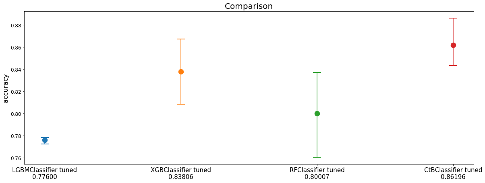
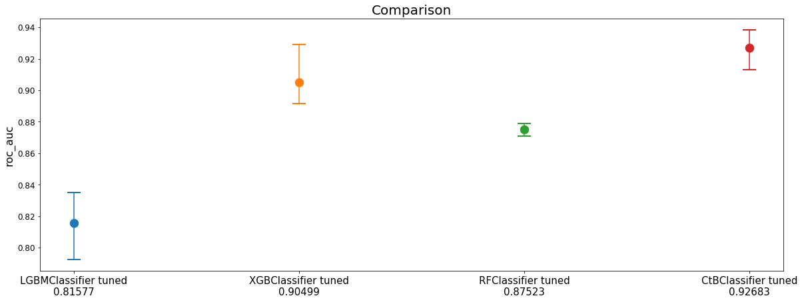
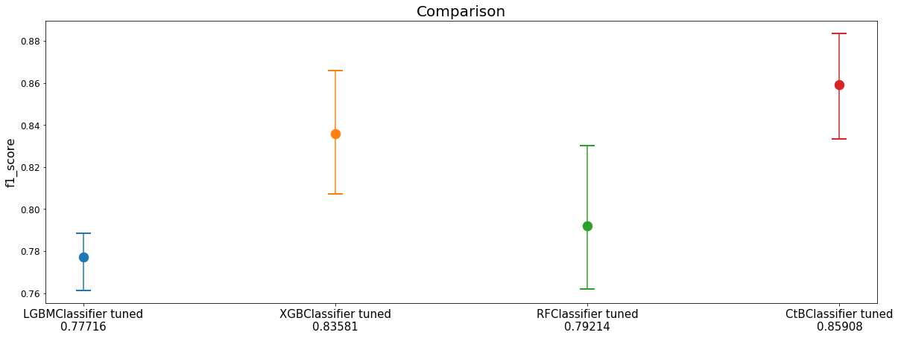
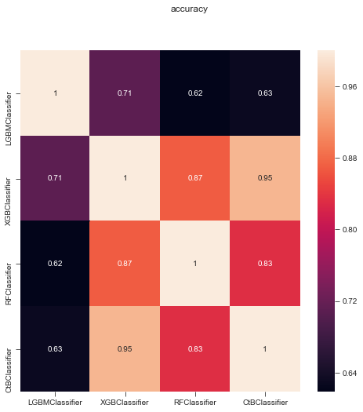
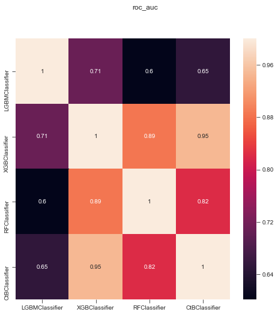
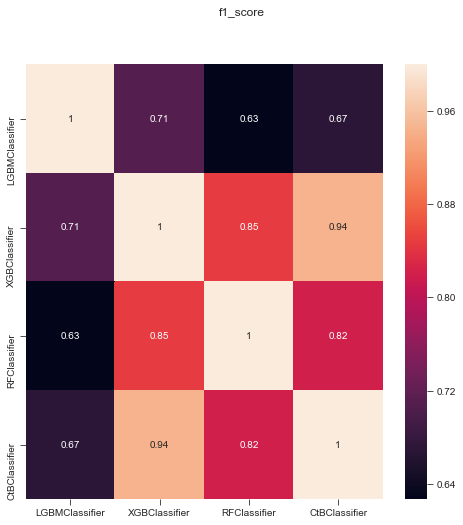

Basic Tutorial
==============

.. raw:: html

   <h3>

Welcome to Modelgym Basic Tutorial.

.. raw:: html

   </h3>

As an example, we will show you how to use Modelgym for binary
classification problem.

.. raw:: html

   <ol>

.. raw:: html

   

In this tutorial we will go through the following steps:

.. raw:: html

   

.. raw:: html

   <li>

Choosing the models.

.. raw:: html

   </li>

.. raw:: html

   <li>

Searching for the best hyperparameters on default spaces using TPE
algorithm locally.

.. raw:: html

   </li>

.. raw:: html

   <li>

Visualizing the results.

.. raw:: html

   </li>

.. raw:: html

   </ol>

Define models we want to use
----------------------------

In this tutorial, we will use

1. LightGBMClassifier
2. XGBoostClassifier
3. RandomForestClassifier
4. CatBoostClassifier

.. code:: ipython3

    from modelgym.models import LGBMClassifier, XGBClassifier, RFClassifier, CtBClassifier

.. parsed-literal::

    /Users/f-minkin/.pyenv/versions/3.6.2/lib/python3.6/site-packages/sklearn/cross_validation.py:41: DeprecationWarning: This module was deprecated in version 0.18 in favor of the model_selection module into which all the refactored classes and functions are moved. Also note that the interface of the new CV iterators are different from that of this module. This module will be removed in 0.20.
      "This module will be removed in 0.20.", DeprecationWarning)

.. code:: ipython3

    models = [LGBMClassifier, XGBClassifier, RFClassifier, CtBClassifier]

Get dataset
-----------

For tutorial purposes we will use toy dataset

.. code:: ipython3

    from sklearn.datasets import make_classification
    from modelgym.utils import XYCDataset

.. code:: ipython3

    X, y = make_classification(n_samples=500, n_features=20, n_informative=10, n_classes=2)
    dataset = XYCDataset(X, y)

Create a TPE trainer
--------------------

.. code:: ipython3

    from modelgym.trainers import TpeTrainer
    trainer = TpeTrainer(models)

Optimize hyperparams
--------------------

We chose accuracy as a main metric that we rely on when optimizing
hyperparams.

Also keep track for RocAuc and F1 measure besides accuracy for our best
models.

Please, keep in mind, that now we’re optimizing hyperparameters from the
default space of hyperparameters. That means, they are not optimal, for
optimal ones and complete understanding follow advanced tutorial.

.. code:: ipython3

    from modelgym.metrics import Accuracy, RocAuc, F1

Of course, it will take some time.

.. code:: ipython3

    %%time
    trainer.crossval_optimize_params(Accuracy(), dataset, metrics=[Accuracy(), RocAuc(), F1()])

.. parsed-literal::

    /Users/f-minkin/.pyenv/versions/3.6.2/lib/python3.6/site-packages/sklearn/metrics/classification.py:1135: UndefinedMetricWarning: F-score is ill-defined and being set to 0.0 due to no predicted samples.
      'precision', 'predicted', average, warn_for)

.. parsed-literal::

    CPU times: user 2h 2min 45s, sys: 47min 59s, total: 2h 50min 45s
    Wall time: 28min 17s

Report best results
-------------------

.. code:: ipython3

    from modelgym.report import Report

.. code:: ipython3

    reporter = Report(trainer.get_best_results(), dataset, [Accuracy(), RocAuc(), F1()])

Report in text form
~~~~~~~~~~~~~~~~~~~

.. code:: ipython3

    reporter.print_all_metric_results()

.. parsed-literal::

    
    ~~~~~~~~~~~~~~~~~~~~~~~~~~~~~~~~~~~~~~~~~~~~~~    accuracy    ~~~~~~~~~~~~~~~~~~~~~~~~~~~~~~~~~~~~~~~~~~~~~~~
    
                                tuned
    LGBMClassifier   0.776002 (0.00%)
    XGBClassifier    0.838059 (8.00%)
    RFClassifier     0.800075 (3.10%)
    CtBClassifier   0.861963 (11.08%)
    
    ~~~~~~~~~~~~~~~~~~~~~~~~~~~~~~~~~~~~~~~~~~~~~~~    roc_auc    ~~~~~~~~~~~~~~~~~~~~~~~~~~~~~~~~~~~~~~~~~~~~~~~
    
                                tuned
    LGBMClassifier   0.815768 (0.00%)
    XGBClassifier   0.904991 (10.94%)
    RFClassifier     0.875230 (7.29%)
    CtBClassifier   0.926832 (13.61%)
    
    ~~~~~~~~~~~~~~~~~~~~~~~~~~~~~~~~~~~~~~~~~~~~~~    f1_score    ~~~~~~~~~~~~~~~~~~~~~~~~~~~~~~~~~~~~~~~~~~~~~~~
    
                                tuned
    LGBMClassifier   0.777157 (0.00%)
    XGBClassifier    0.835813 (7.55%)
    RFClassifier     0.792136 (1.93%)
    CtBClassifier   0.859078 (10.54%)

Report plots
~~~~~~~~~~~~

.. code:: ipython3

    reporter.plot_all_metrics()

.. parsed-literal::

    
    ~~~~~~~~~~~~~~~~~~~~~~~~~~~~~~~~~~~~~~~~~~~~~~    accuracy    ~~~~~~~~~~~~~~~~~~~~~~~~~~~~~~~~~~~~~~~~~~~~~~~
    

.. parsed-literal::

    
    ~~~~~~~~~~~~~~~~~~~~~~~~~~~~~~~~~~~~~~~~~~~~~~~    roc_auc    ~~~~~~~~~~~~~~~~~~~~~~~~~~~~~~~~~~~~~~~~~~~~~~~
    

.. parsed-literal::

    
    ~~~~~~~~~~~~~~~~~~~~~~~~~~~~~~~~~~~~~~~~~~~~~~    f1_score    ~~~~~~~~~~~~~~~~~~~~~~~~~~~~~~~~~~~~~~~~~~~~~~~
    

Report heatmaps for each metric
~~~~~~~~~~~~~~~~~~~~~~~~~~~~~~~

.. code:: ipython3

    reporter.plot_heatmaps()

.. parsed-literal::

    
    ~~~~~~~~~~~~~~~~~~~~~~~~~~~~~~~~~~~~~~~~~~~~~~    accuracy    ~~~~~~~~~~~~~~~~~~~~~~~~~~~~~~~~~~~~~~~~~~~~~~~
    

.. parsed-literal::

    
    ~~~~~~~~~~~~~~~~~~~~~~~~~~~~~~~~~~~~~~~~~~~~~~~    roc_auc    ~~~~~~~~~~~~~~~~~~~~~~~~~~~~~~~~~~~~~~~~~~~~~~~
    

.. parsed-literal::

    
    ~~~~~~~~~~~~~~~~~~~~~~~~~~~~~~~~~~~~~~~~~~~~~~    f1_score    ~~~~~~~~~~~~~~~~~~~~~~~~~~~~~~~~~~~~~~~~~~~~~~~
    

That’s it!

If you like it, please follow the advanced tutorial and learn all
features modelgym can provide.
