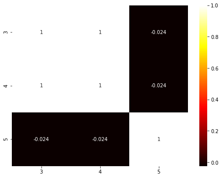
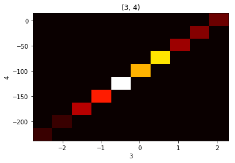
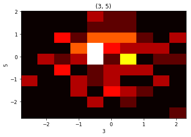
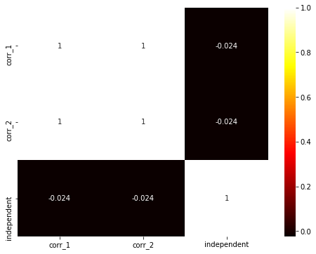

Guru example
============

.. code:: ipython3

    from modelgym import Guru
    import numpy as np

Initialize Guru

.. code:: ipython3

    guru = Guru()

Make toy dataset

.. code:: ipython3

    n = 100
    np.random.seed(0)
    X = np.zeros((n, 6), dtype=object)
    
    # make not numeric feature
    X[:, 0] = 'not a number'
    
    # make categorial feature
    X[:, 1] = np.random.binomial(3, 0.6, size=n)
    
    # make sparse feature
    X[:, 2] = np.random.binomial(1, 0.05, size=n) * np.random.normal(size=n)
    
    # make correlated features
    X[:, 3] = np.random.normal(size=n)
    X[:, 4] = X[:, 3] * 50 - 100
    
    # make independent feature
    X[:, 5] = np.random.normal(size=n)
    
    # make disbalanced classes
    y = np.random.binomial(3, 0.9, size=n)

Main features
-------------

Looking for categorical features

.. code:: ipython3

    guru.check_categorial(X)

.. parsed-literal::

    Some features are supposed to be categorial. Make sure that all categorial features are in cat_cols.
    Following features are not numeric:  [0]
    Following features are not variable:  [1]

.. parsed-literal::

    defaultdict(list, {'not numeric': [0], 'not variable': [1]})

Looking for sparse features

.. code:: ipython3

    guru.check_sparse(X)

.. parsed-literal::

    Consider use hashing trick for your sparse features, if you haven't already. Following features are supposed to be sparse:  [2]

.. parsed-literal::

    [2]

Looking for correlated features

.. code:: ipython3

    guru.check_correlation(X, [3, 4, 5])

.. parsed-literal::

    There are several correlated features. Consider dimention reduction, for example you can use PCA. Following pairs of features are supposed to be correlated:  [(3, 4)]

.. parsed-literal::

    [(3, 4)]

Drawing correlation heatmap for features

.. code:: ipython3

    guru.draw_correlation_heatmap(X, [3, 4, 5], figsize=(8, 6))

Drawing 2d histograms for features

.. code:: ipython3

    guru.draw_2dhist(X, [3, 4, 5])

Looking for disbalanced classes

.. code:: ipython3

    guru.check_class_disbalance(y)

.. parsed-literal::

    There is class disbalance. Probably, you can solve it by data augmentation.
    Following classes are too common:  [3]
    Following classes are too rare:  [1, 0]

.. parsed-literal::

    defaultdict(list, {'too common': [3], 'too rare': [1, 0]})

dtype with fields
-----------------

| You can also use array with dtype with fields
| Let’s make another representation of the same data

.. code:: ipython3

    named_X = np.zeros((n,), dtype=[('str', 'U25'),
                                    ('categorial', 'int'),
                                    ('sparse', float),
                                    ('corr_1', float),
                                    ('corr_2', float),
                                    ('independent', float)])
    for i, name in enumerate(named_X.dtype.names):
        named_X[name] = X[:, i]

Now we can draw heatmap like this

.. code:: ipython3

    guru.draw_correlation_heatmap(named_X, ['corr_1', 'corr_2', 'independent'], figsize=(8, 6))

