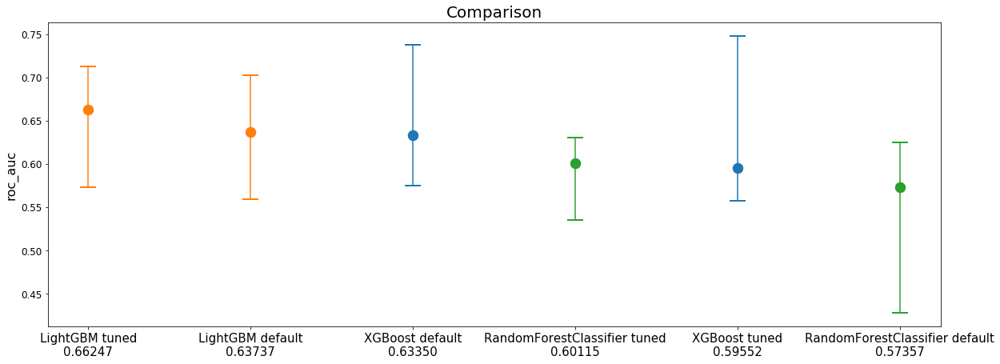

Training example
================

.. code:: ipython3

    import functools
    import itertools
    import modelgym
    import numpy as np
    import os
    import pickle
    
    from collections import OrderedDict
    from hyperopt.mongoexp import MongoTrials
    from sklearn.metrics import roc_auc_score
    from sklearn.model_selection import train_test_split
    
    from modelgym.metric import RocAuc, Accuracy
    from modelgym.tracker import ProgressTrackerFile, ProgressTrackerMongo
    from modelgym.trainer import Trainer
    from modelgym.util import TASK_CLASSIFICATION, split_and_preprocess

.. parsed-literal::

    /Users/f-minkin/.pyenv/versions/3.6.2/lib/python3.6/site-packages/sklearn/cross_validation.py:41: DeprecationWarning: This module was deprecated in version 0.18 in favor of the model_selection module into which all the refactored classes and functions are moved. Also note that the interface of the new CV iterators are different from that of this module. This module will be removed in 0.20.
      "This module will be removed in 0.20.", DeprecationWarning)

.. code:: ipython3

    ########### NROWS, N_ESTIMATORS, N_PROBES, TEST_SIZE, N_CV_SPLITS, OPTIMIZER
    config_tuple = {
        'test': (1000, 100,  2, 0.5, 2, 'random'),
        'pror': (None, 1000, 100, 0.5, 2, 'random'), # production with random hyperopt suggestor
        'prot': (None, 1000, 100, 0.5, 2, 'tpe'),    # production with tpe hyperopt suggestor
        'demi': (10000, 100, 5, 0.5, 2, 'random')
    }
    CONFIG = 'test' if 'EXP_CONFIG' not in os.environ else os.environ['EXP_CONFIG']
    NROWS, N_ESTIMATORS, N_PROBES, TEST_SIZE, N_CV_SPLITS, OPTIMIZER = config_tuple[CONFIG]
    CANDIDATES = OrderedDict([
        ('XGBoost', modelgym.XGBModel), 
        ('LightGBM', modelgym.LGBModel),
        ('RandomForestClassifier', modelgym.RFModel)
    ])
    RESULTS_DIR = "results"
    LOAD_CACHE = False
    if 'MONGO_PORT_27017_TCP_ADDR' in os.environ:
        mongo_host = os.environ['MONGO_PORT_27017_TCP_ADDR'] if 'MONGO_PORT_27017_TCP_ADDR' in os.environ else 'cern-mc01h'
        mongo_port = int(os.environ['MONGO_PORT_27017_TCP_PORT']) if 'MONGO_PORT_27017_TCP_PORT' in os.environ else 27017
        mongo_db = os.environ['MONGO_DB'] if 'MONGO_DB' in os.environ else 'trials'
        tracker_factory = functools.partial(ProgressTrackerMongo, mongo_host, mongo_port, mongo_db, config_key=CONFIG)
        print ("Using Mongo as backend for tracking")
    else:
        tracker_factory = functools.partial(ProgressTrackerFile, RESULTS_DIR, config_key=CONFIG)
        print ("Using File as backend for tracking")
    
    print ("Running experiment cofiguration:", CONFIG)

.. parsed-literal::

    Using File as backend for tracking
    Running experiment cofiguration: test

Download & read data file
-------------------------

.. code:: bash

    %%bash 
    if [ ! -d data ] ; then 
        mkdir data 
        cd data
        curl https://cernbox.cern.ch/index.php/s/N1dpSAPgl30szYM/download | gunzip -c > XY2d.pickle
        cd ..
    fi
    ls -l data

.. parsed-literal::

    total 266224
    -rw-r--r--  1 f-minkin  LD\Domain Users  136304022 Nov 13 02:57 XY2d.pickle

.. code:: ipython3

    def read_data(fname, nrows=None, shuffle=True):
        with open(fname,'rb') as fh:
            X, y = pickle.load(fh,encoding='bytes')
        index = np.arange(X.shape[0])
        if nrows is None:
            nrows = X.shape[0]
        weights = np.ones(nrows) # uh, well...
        if shuffle:
            index_perm = np.random.permutation(index)
        else:
            index_perm = index
        return X[index_perm[:nrows]], y[index_perm[:nrows]], weights
    
    
    X, y, weights = read_data("data/XY2d.pickle", nrows=NROWS)

.. code:: ipython3

    X_train, X_test, y_train, y_test, w_train, w_test = train_test_split(X, y, weights, test_size=TEST_SIZE)

.. code:: ipython3

    cv_pairs, (dtrain, dtest) = split_and_preprocess(X_train.copy(), y_train, 
                                                    X_test.copy(), y_test, 
                                                    cat_cols=[], n_splits=N_CV_SPLITS)

Run them all
------------

.. code:: ipython3

    def init_keys_dict():
        return dict(
            [(k, {'default_cv': None, 'tuned_cv': None, 'default_test': None, 'tuned_test': None, 'trials': None}) for k in
             CANDIDATES.keys()])
    
    
    trackers = {}
    custom_metrics = [RocAuc(), Accuracy()]
    all_metrics = init_keys_dict()
    trainer = Trainer(opt_evals=N_PROBES, n_estimators=N_ESTIMATORS)

.. code:: ipython3

    def gym_training(trainer, model, all_metrics, trackers, cv_pairs, dtrain, dtest, mode):
        name = model.get_name()
        metrics = all_metrics[name]
        tracker = trackers[name]
        cv_key = mode + "_cv"
        test_key = mode + "_test"
        if metrics[cv_key] is None:
            if mode == "default":
                metrics[cv_key] = trainer.crossval_fit_eval(model, cv_pairs,
                                                            custom_metrics=custom_metrics)
            elif mode == "tuned":
                print('Hyperopt iterations:\n\n')
                metrics[cv_key] = trainer.crossval_optimize_params(model, cv_pairs, algo_name=OPTIMIZER,
                                                                   trials=metrics['trials'],
                                                                   tracker=tracker, 
                                                                   custom_metrics=custom_metrics)
            else:
                raise ValueError("{0} not expected".format(mode))
            tracker._update_state(metrics[cv_key])
        trainer.print_result(metrics[cv_key], '{0} {1} result on CV'.format(mode, name),
                             extra_keys=[metric.name for metric in custom_metrics])
    
        if metrics[test_key] is None:
            metrics[test_key] = trainer.fit_eval(model, dtrain, dtest,
                                                 metrics[cv_key]['params'],
                                                 metrics[cv_key]['best_n_estimators'],
                                                 custom_metrics=custom_metrics,
                                                 compute_additional_statistics=True)
            tracker._update_state(metrics)
        trainer.print_result(metrics[test_key], '{0} {1} result on TEST'.format(mode, name),
                             extra_keys=[metric.name for metric in custom_metrics])

.. code:: ipython3

    for model_class in CANDIDATES.values():
        model = model_class(TASK_CLASSIFICATION)
        name = model.get_name()
        print("\n" + "~" * 20, name, "~" * 20)
        trackers[name] = tracker_factory(model_name=name)
        if LOAD_CACHE:
            all_metrics[name] = trackers[name].load_state()
    
        gym_training(trainer, model, all_metrics, trackers, cv_pairs, dtrain, dtest, 'default')
        gym_training(trainer, model, all_metrics, trackers, cv_pairs, dtrain, dtest, 'tuned')
    
        trackers[name].save_state()

.. parsed-literal::

    
    ~~~~~~~~~~~~~~~~~~~~ XGBoost ~~~~~~~~~~~~~~~~~~~~
    
    default XGBoost result on CV:
    
    loss = 0.37413947
    best_n_estimators = 1
    roc_auc = 0.766874
    accuracy = 0.880000
    params = {'base_score': 0.5, 'colsample_bylevel': 1, 'colsample_bytree': 1, 'gamma': 0, 'learning_rate': 0.1, 'max_delta_step': 0, 'max_depth': 3, 'min_child_weight': 1, 'missing': None, 'n_estimators': 100, 'nthread': -1, 'reg_alpha': 0, 'reg_lambda': 1, 'scale_pos_weight': 1, 'seed': 0, 'subsample': 1, 'objective': 'binary:logistic', 'eval_metric': 'logloss', 'silent': 1}
    
    default XGBoost result on TEST:
    
    loss = 0.642897
    n_estimators = 1
    roc_auc = 0.633497
    accuracy = 0.832000
    params = {'base_score': 0.5, 'colsample_bylevel': 1, 'colsample_bytree': 1, 'gamma': 0, 'learning_rate': 0.1, 'max_delta_step': 0, 'max_depth': 3, 'min_child_weight': 1, 'missing': None, 'n_estimators': 100, 'nthread': -1, 'reg_alpha': 0, 'reg_lambda': 1, 'scale_pos_weight': 1, 'seed': 0, 'subsample': 1, 'objective': 'binary:logistic', 'eval_metric': 'logloss', 'silent': 1}
    Hyperopt iterations:
    
    
    [1/2]	eval_time=0.18 sec	current_logloss=0.645989	min_logloss=0.645989
    [2/2]	eval_time=0.10 sec	current_logloss=0.517816	min_logloss=0.517816
    saved state to results/tracker_test_XGBoost.pickle
    
    tuned XGBoost result on CV:
    
    loss = 0.51781561
    best_n_estimators = 1
    roc_auc = 0.771158
    accuracy = 0.864000
    params = {'alpha': 0.000624361142368818, 'colsample_bylevel': 0.6278474089136892, 'colsample_bytree': 0.5292435929542255, 'eta': 0.45954327406619383, 'gamma': 0.0008064719242845735, 'lambdax': 1.5481980017877143e-06, 'max_depth': 5, 'min_child_weight': 4.1073662953607967e-07, 'subsample': 0.8513224962221795, 'objective': 'binary:logistic', 'eval_metric': 'logloss', 'silent': 1}
    
    tuned XGBoost result on TEST:
    
    loss = 0.519781
    n_estimators = 1
    roc_auc = 0.595521
    accuracy = 0.806000
    params = {'alpha': 0.000624361142368818, 'colsample_bylevel': 0.6278474089136892, 'colsample_bytree': 0.5292435929542255, 'eta': 0.45954327406619383, 'gamma': 0.0008064719242845735, 'lambdax': 1.5481980017877143e-06, 'max_depth': 5, 'min_child_weight': 4.1073662953607967e-07, 'subsample': 0.8513224962221795, 'objective': 'binary:logistic', 'eval_metric': 'logloss', 'silent': 1}
    saved state to results/tracker_test_XGBoost.pickle
    
    ~~~~~~~~~~~~~~~~~~~~ LightGBM ~~~~~~~~~~~~~~~~~~~~
    
    default LightGBM result on CV:
    
    loss = 0.432559717355
    best_n_estimators = 1
    roc_auc = 0.732477
    accuracy = 0.860000
    params = {'boosting_type': 'gbdt', 'colsample_bytree': 1, 'drop_rate': 0.1, 'is_unbalance': False, 'learning_rate': 0.1, 'max_bin': 255, 'min_data_in_leaf': 20, 'max_depth': -1, 'max_drop': 50, 'min_child_samples': 10, 'min_child_weight': 5, 'min_split_gain': 0, 'min_sum_hessian_in_leaf': 0.001, 'lambda_l1': 0, 'lambda_l2': 0, 'nthread': 4, 'num_threads': 4, 'num_leaves': 31, 'reg_alpha': 0, 'reg_lambda': 0, 'scale_pos_weight': 1, 'seed': 0, 'sigmoid': 1.0, 'skip_drop': 0.5, 'subsample': 1, 'subsample_for_bin': 50000, 'subsample_freq': 1, 'uniform_drop': False, 'xgboost_dart_mode': False, 'objective': 'binary', 'metric': 'binary_logloss', 'bagging_freq': 1, 'verbose': -1}
    
    default LightGBM result on TEST:
    
    loss = 0.642003341637
    n_estimators = 1
    roc_auc = 0.637366
    accuracy = 0.812000
    params = {'boosting_type': 'gbdt', 'colsample_bytree': 1, 'drop_rate': 0.1, 'is_unbalance': False, 'learning_rate': 0.1, 'max_bin': 255, 'min_data_in_leaf': 20, 'max_depth': -1, 'max_drop': 50, 'min_child_samples': 10, 'min_child_weight': 5, 'min_split_gain': 0, 'min_sum_hessian_in_leaf': 0.001, 'lambda_l1': 0, 'lambda_l2': 0, 'nthread': 4, 'num_threads': 4, 'num_leaves': 31, 'reg_alpha': 0, 'reg_lambda': 0, 'scale_pos_weight': 1, 'seed': 0, 'sigmoid': 1.0, 'skip_drop': 0.5, 'subsample': 1, 'subsample_for_bin': 50000, 'subsample_freq': 1, 'uniform_drop': False, 'xgboost_dart_mode': False, 'objective': 'binary', 'metric': 'binary_logloss', 'bagging_freq': 1, 'verbose': -1}
    Hyperopt iterations:
    
    
    [1/2]	eval_time=0.04 sec	current_logloss=0.693147	min_logloss=0.693147
    [2/2]	eval_time=0.20 sec	current_logloss=0.633345	min_logloss=0.633345
    saved state to results/tracker_test_LightGBM.pickle
    
    tuned LightGBM result on CV:
    
    loss = 0.6333449333363612
    best_n_estimators = 1
    roc_auc = 0.766745
    accuracy = 0.856000
    params = {'bagging_fraction': 0.6278474089136892, 'feature_fraction': 0.5292435929542255, 'lambda_l1': 1.000657505552681, 'lambda_l2': 0.0008064719242845735, 'learning_rate': 0.0025275717184566064, 'min_data_in_leaf': 10, 'min_sum_hessian_in_leaf': 4.1073662953607967e-07, 'num_leaves': 137, 'objective': 'binary', 'metric': 'binary_logloss', 'bagging_freq': 1, 'verbose': -1, 'max_bin': 255}
    
    tuned LightGBM result on TEST:
    
    loss = 0.69175461912
    n_estimators = 1
    roc_auc = 0.662470
    accuracy = 0.824000
    params = {'bagging_fraction': 0.6278474089136892, 'feature_fraction': 0.5292435929542255, 'lambda_l1': 1.000657505552681, 'lambda_l2': 0.0008064719242845735, 'learning_rate': 0.0025275717184566064, 'min_data_in_leaf': 10, 'min_sum_hessian_in_leaf': 4.1073662953607967e-07, 'num_leaves': 137, 'objective': 'binary', 'metric': 'binary_logloss', 'bagging_freq': 1, 'verbose': -1, 'max_bin': 255}
    saved state to results/tracker_test_LightGBM.pickle
    
    ~~~~~~~~~~~~~~~~~~~~ RandomForestClassifier ~~~~~~~~~~~~~~~~~~~~
    
    default RandomForestClassifier result on CV:
    
    loss = 0.854259117188
    best_n_estimators = 2
    roc_auc = 0.780504
    accuracy = 0.856000
    params = {'max_depth': 1, 'max_features': 4, 'n_estimators': 10, 'criterion': 'gini', 'verbose': 0, 'min_samples_split': 2, 'min_samples_leaf': 1, 'min_weight_fraction_leaf': 0.0, 'min_impurity_split': 1e-07}
    
    default RandomForestClassifier result on TEST:
    
    loss = 0.892441576471
    n_estimators = 2
    roc_auc = 0.573571
    accuracy = 0.836000
    params = {'max_depth': 1, 'max_features': 4, 'n_estimators': 10, 'criterion': 'gini', 'verbose': 0, 'min_samples_split': 2, 'min_samples_leaf': 1, 'min_weight_fraction_leaf': 0.0, 'min_impurity_split': 1e-07}
    Hyperopt iterations:
    
    
    [1/2]	eval_time=0.33 sec	current_logloss=0.854930	min_logloss=0.854930
    [2/2]	eval_time=0.34 sec	current_logloss=0.854200	min_logloss=0.854200
    saved state to results/tracker_test_RandomForestClassifier.pickle
    
    tuned RandomForestClassifier result on CV:
    
    loss = 0.8542
    best_n_estimators = 2
    roc_auc = 0.814901
    accuracy = 0.844000
    params = {'criterion': 'entropy', 'max_depth': 17, 'max_features': 3, 'min_samples_leaf': 4.0, 'min_samples_split': 9.0, 'n_estimators': 2, 'verbose': 0}
    
    tuned RandomForestClassifier result on TEST:
    
    loss = 0.0
    n_estimators = 2
    roc_auc = 0.601146
    accuracy = 0.714000
    params = {'criterion': 'entropy', 'max_depth': 17, 'max_features': 3, 'min_samples_leaf': 4.0, 'min_samples_split': 9.0, 'n_estimators': 2, 'verbose': 0}
    saved state to results/tracker_test_RandomForestClassifier.pickle

Compare
-------

.. code:: ipython3

    full_results = {}
    for i in CANDIDATES.keys():
        if i in trackers:
            tracker = trackers[i]
        else:
            tracker = tracker_factory(model_name=i)
            tracker.load_state()
        full_results.update({i:{'tuned': tracker.state['tuned_test'], 'default': tracker.state['default_test']}})

.. code:: ipython3

    
    from modelgym.report import Report
    
    rep = Report(results=full_results, models_dict=CANDIDATES,
                 models_holder=trackers,
                 test_set=dtest, metrics=custom_metrics,
                 task_type=TASK_CLASSIFICATION)

Plots
~~~~~

.. code:: ipython3

    rep.plot_all_metrics()

.. parsed-literal::

    
    ~~~~~~~~~~~~~~~~~~~~~~~~~~~~~~~~~~~~~~~~~~~~~~~    roc_auc    ~~~~~~~~~~~~~~~~~~~~~~~~~~~~~~~~~~~~~~~~~~~~~~~
    

.. parsed-literal::

    
    ~~~~~~~~~~~~~~~~~~~~~~~~~~~~~~~~~~~~~~~~~~~~~~    accuracy    ~~~~~~~~~~~~~~~~~~~~~~~~~~~~~~~~~~~~~~~~~~~~~~~
    

.. image:: images/model_search_16_3.png

Check quality differences
~~~~~~~~~~~~~~~~~~~~~~~~~

.. code:: ipython3

    rep.print_all_metric_results()

.. parsed-literal::

    
    ~~~~~~~~~~~~~~~~~~~~~~~~~~~~~~~~~~~~~~~~~~~~~~~    roc_auc    ~~~~~~~~~~~~~~~~~~~~~~~~~~~~~~~~~~~~~~~~~~~~~~~
    
                                       default               tuned
    XGBoost                 0.633497 (+10.45%)   0.595521 (+3.83%)
    LightGBM                0.637366 (+11.12%)  0.662470 (+15.50%)
    RandomForestClassifier   0.573571 (+0.00%)   0.601146 (+4.81%)
    
    ~~~~~~~~~~~~~~~~~~~~~~~~~~~~~~~~~~~~~~~~~~~~~~    accuracy    ~~~~~~~~~~~~~~~~~~~~~~~~~~~~~~~~~~~~~~~~~~~~~~~
    
                                       default               tuned
    XGBoost                 0.832000 (+16.53%)  0.806000 (+12.89%)
    LightGBM                0.812000 (+13.73%)  0.824000 (+15.41%)
    RandomForestClassifier  0.836000 (+17.09%)   0.714000 (-0.00%)

Check correlation maps
~~~~~~~~~~~~~~~~~~~~~~

.. code:: ipython3

    rep.plot_heatmaps()

.. parsed-literal::

    
    ~~~~~~~~~~~~~~~~~~~~~~~~~~~~~~~~~~~~~~~~~~~~~~~    roc_auc    ~~~~~~~~~~~~~~~~~~~~~~~~~~~~~~~~~~~~~~~~~~~~~~~
    

.. image:: images/model_search_20_1.png

.. parsed-literal::

    
    ~~~~~~~~~~~~~~~~~~~~~~~~~~~~~~~~~~~~~~~~~~~~~~    accuracy    ~~~~~~~~~~~~~~~~~~~~~~~~~~~~~~~~~~~~~~~~~~~~~~~
    

.. image:: images/model_search_20_3.png

.. code:: ipython3

    # You can glance at everything at once using the following:
    # rep.summary()

Compare models with stat test
=============================

Compare that out tuned RF model is statistically better than default
--------------------------------------------------------------------

.. code:: ipython3

    from sklearn.ensemble import RandomForestClassifier
    default_rf_model = RandomForestClassifier()
    default_rf_model.fit(dtrain.X, dtrain.y)
    
    tuned_rf_model = full_results['RandomForestClassifier']['tuned']['bst']
    
    print('Two models are different: {}, p-value {}'.format(
        *modelgym.util.compare_models_different(tuned_rf_model, default_rf_model, dtest)
    ))

.. parsed-literal::

    Two models are different: False, p-value [[ 0.99343407]]

Compare default LightGBM and default RF
---------------------------------------

.. code:: ipython3

    import lightgbm
    default_lightGBM_model = lightgbm.LGBMClassifier()
    default_lightGBM_model.fit(dtrain.X, dtrain.y)
    
    print('Two models are different: {}, p-value {}'.format(
        *modelgym.util.compare_models_different(default_lightGBM_model, default_rf_model, dtest)
    ))

.. parsed-literal::

    Two models are different: True, p-value [[  5.99814530e-06]]

