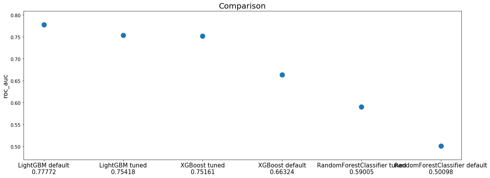

Training example
================

.. code:: ipython3

    import os
    import pickle
    import itertools
    import pandas as pd
    import numpy as np
    #from modelgym import model
    import functools
    import modelgym
    from modelgym.util import TASK_CLASSIFICATION
    from modelgym.trainer import Trainer
    from modelgym.tracker import ProgressTrackerFile, ProgressTrackerMongo
    from sklearn.metrics import roc_auc_score
    from hyperopt.mongoexp import MongoTrials
    from modelgym.util import split_and_preprocess
    from sklearn.model_selection import train_test_split
    from collections import OrderedDict

.. parsed-literal::

    /home/alexander/venv/my_modelgym/lib/python3.5/site-packages/sklearn/cross_validation.py:41: DeprecationWarning: This module was deprecated in version 0.18 in favor of the model_selection module into which all the refactored classes and functions are moved. Also note that the interface of the new CV iterators are different from that of this module. This module will be removed in 0.20.
      "This module will be removed in 0.20.", DeprecationWarning)

.. code:: ipython3

    ########### NROWS, N_ESTIMATORS, N_PROBES, TEST_SIZE, N_CV_SPLITS, OPTIMIZER
    config_tuple = {
        'test': (1000, 100,  2, 0.5, 2, 'random'),
        'pror': (None, 1000, 100, 0.5, 2, 'random'), # production with random hyperopt suggestor
        'prot': (None, 1000, 100, 0.5, 2, 'tpe'),    # production with tpe hyperopt suggestor
        'demi': (10000, 100, 5, 0.5, 2, 'random')
    }
    CONFIG = 'test' if 'EXP_CONFIG' not in os.environ else os.environ['EXP_CONFIG']
    NROWS, N_ESTIMATORS, N_PROBES, TEST_SIZE, N_CV_SPLITS, OPTIMIZER = config_tuple[CONFIG]
    CANDIDATES = OrderedDict([
        ('XGBoost', modelgym.XGBModel), 
        ('LightGBM', modelgym.LGBModel),
        ('RandomForestClassifier',modelgym.RFModel)
    ])
    RESULTS_DIR = "results"
    LOAD_CACHE = False
    if 'MONGO_PORT_27017_TCP_ADDR' in os.environ:
        mongo_host = os.environ['MONGO_PORT_27017_TCP_ADDR'] if 'MONGO_PORT_27017_TCP_ADDR' in os.environ else 'cern-mc01h'
        mongo_port = int(os.environ['MONGO_PORT_27017_TCP_PORT']) if 'MONGO_PORT_27017_TCP_PORT' in os.environ else 27017
        mongo_db = os.environ['MONGO_DB'] if 'MONGO_DB' in os.environ else 'trials'
        tracker_factory = functools.partial(ProgressTrackerMongo, mongo_host, mongo_port, mongo_db, config_key=CONFIG)
        print ("Using Mongo as backend for tracking")
    else:
        tracker_factory = functools.partial(ProgressTrackerFile, RESULTS_DIR, config_key=CONFIG)
        print ("Using File as backend for tracking")
    
    print ("Running experiment cofiguration:", CONFIG)

.. parsed-literal::

    Using File as backend for tracking
    Running experiment cofiguration: test

Download & read data file
-------------------------

.. code:: bash

    %%bash 
    if [ ! -d data ] ; then 
        mkdir data 
        cd data
        curl https://cernbox.cern.ch/index.php/s/N1dpSAPgl30szYM/download | gunzip -c > XY2d.pickle
        cd ..
    fi
    ls -l data

.. parsed-literal::

    total 133112
    -rw-rw-r-- 1 alexander alexander 136304022 окт 12 01:22 XY2d.pickle

.. code:: ipython3

    def read_data(fname, nrows=None, shuffle=True):
        with open(fname,'rb') as fh:
            X, y = pickle.load(fh,encoding='bytes')
        index = np.arange(X.shape[0])
        if nrows is None:
            nrows = X.shape[0]
        weights = np.ones(nrows) # uh, well...
        if shuffle:
            index_perm = np.random.permutation(index)
        else:
            index_perm = index
        return X[index_perm[:nrows]], y[index_perm[:nrows]], weights
    
    
    X, y, weights = read_data("data/XY2d.pickle", nrows=NROWS)

.. code:: ipython3

    X_train, X_test, y_train, y_test, w_train, w_test = train_test_split(X, y, weights, test_size=TEST_SIZE)

.. code:: ipython3

    cv_pairs, (dtrain, dtest) = split_and_preprocess(X_train.copy(), y_train, 
                                                    X_test.copy(), y_test, 
                                                    cat_cols=[], n_splits=N_CV_SPLITS)

Run them all
------------

.. code:: ipython3

    def init_keys_dict():
        return dict(
            [(k, {'default_cv': None, 'tuned_cv': None, 'default_test': None, 'tuned_test': None, 'trials': None}) for k in
             CANDIDATES.keys()])
    
    
    trackers = {}
    custom_metric = {'roc_auc': roc_auc_score}
    all_metrics = init_keys_dict()
    trainer = Trainer(opt_evals=N_PROBES, n_estimators=N_ESTIMATORS)

.. code:: ipython3

    def gym_training(trainer, model, all_metrics, trackers, cv_pairs, dtrain, dtest, mode):
        name = model.get_name()
        metrics = all_metrics[name]
        tracker = trackers[name]
        cv_key = mode + "_cv"
        test_key = mode + "_test"
        if metrics[cv_key] is None:
            if mode == "default":
                metrics[cv_key] = trainer.crossval_fit_eval(model, cv_pairs)
            elif mode == "tuned":
                print('Hyperopt iterations:\n\n')
                metrics[cv_key] = trainer.crossval_optimize_params(model, cv_pairs, algo_name=OPTIMIZER,
                                                                   trials=metrics['trials'],
                                                                   tracker=tracker)
            else:
                raise ValueError("{0} not expected".format(mode))
            tracker._update_state(metrics)
        trainer.print_result(metrics[cv_key], '{0} {1} result on CV'.format(mode, name))
    
        if metrics[test_key] is None:
            metrics[test_key] = trainer.fit_eval(model, dtrain, dtest,
                                                 metrics[cv_key]['params'],
                                                 metrics[cv_key]['best_n_estimators'],
                                                 custom_metric=custom_metric)
            tracker._update_state(metrics)
        trainer.print_result(metrics[test_key], '{0} {1} result on TEST'.format(mode, name), extra_keys=['roc_auc'])

.. code:: ipython3

    for model_class in CANDIDATES.values():
        model = model_class(TASK_CLASSIFICATION)
        name = model.get_name()
        print("~" * 20, name, "~" * 20)
        trackers[name] = tracker_factory(model_name=name)
        if LOAD_CACHE:
            all_metrics[name] = trackers[name].load_state()
    
        gym_training(trainer, model, all_metrics, trackers, cv_pairs, dtrain, dtest, 'default')
        gym_training(trainer, model, all_metrics, trackers, cv_pairs, dtrain, dtest, 'tuned')
    
        trackers[name].save_state()

.. parsed-literal::

    ~~~~~~~~~~~~~~~~~~~~ XGBoost ~~~~~~~~~~~~~~~~~~~~
    default XGBoost result on CV:
    
    loss = 0.42284588
    best_n_estimators = 2
    params = {'gamma': 0, 'reg_alpha': 0, 'min_child_weight': 1, 'max_delta_step': 0, 'base_score': 0.5, 'silent': 1, 'reg_lambda': 1, 'seed': 0, 'nthread': -1, 'learning_rate': 0.1, 'scale_pos_weight': 1, 'objective': 'binary:logistic', 'colsample_bylevel': 1, 'eval_metric': 'logloss', 'missing': None, 'subsample': 1, 'n_estimators': 100, 'colsample_bytree': 1, 'max_depth': 3}
    default XGBoost result on TEST:
    
    loss = 0.614406
    n_estimators = 2
    params = {'gamma': 0, 'reg_alpha': 0, 'min_child_weight': 1, 'max_delta_step': 0, 'base_score': 0.5, 'silent': 1, 'reg_lambda': 1, 'seed': 0, 'nthread': -1, 'learning_rate': 0.1, 'scale_pos_weight': 1, 'objective': 'binary:logistic', 'colsample_bylevel': 1, 'eval_metric': 'logloss', 'missing': None, 'subsample': 1, 'n_estimators': 100, 'colsample_bytree': 1, 'max_depth': 3}
    roc_auc = 0.663240
    Hyperopt iterations:
    
    
    [1/2]	eval_time=0.20 sec	current_logloss=0.654924	min_logloss=0.654924
    [2/2]	eval_time=0.10 sec	current_logloss=0.444354	min_logloss=0.444354
    saved state to results/tracker_test_XGBoost.pickle
    tuned XGBoost result on CV:
    
    loss = 0.4443543
    best_n_estimators = 2
    params = {'gamma': 0.0008064719242845735, 'lambdax': 1.5481980017877143e-06, 'min_child_weight': 4.1073662953607967e-07, 'objective': 'binary:logistic', 'eta': 0.45954327406619383, 'colsample_bylevel': 0.6278474089136892, 'alpha': 0.000624361142368818, 'eval_metric': 'logloss', 'subsample': 0.8513224962221795, 'silent': 1, 'colsample_bytree': 0.5292435929542255, 'max_depth': 5}
    tuned XGBoost result on TEST:
    
    loss = 0.44609
    n_estimators = 2
    params = {'gamma': 0.0008064719242845735, 'lambdax': 1.5481980017877143e-06, 'min_child_weight': 4.1073662953607967e-07, 'objective': 'binary:logistic', 'eta': 0.45954327406619383, 'colsample_bylevel': 0.6278474089136892, 'alpha': 0.000624361142368818, 'eval_metric': 'logloss', 'subsample': 0.8513224962221795, 'silent': 1, 'colsample_bytree': 0.5292435929542255, 'max_depth': 5}
    roc_auc = 0.751615
    saved state to results/tracker_test_XGBoost.pickle
    ~~~~~~~~~~~~~~~~~~~~ LightGBM ~~~~~~~~~~~~~~~~~~~~
    default LightGBM result on CV:
    
    loss = 0.46476010839
    best_n_estimators = 2
    params = {'drop_rate': 0.1, 'metric': 'binary_logloss', 'skip_drop': 0.5, 'num_threads': 4, 'num_leaves': 31, 'uniform_drop': False, 'lambda_l1': 0, 'reg_lambda': 0, 'seed': 0, 'boosting_type': 'gbdt', 'is_unbalance': False, 'objective': 'binary', 'min_child_samples': 10, 'max_drop': 50, 'nthread': 4, 'subsample': 1, 'verbose': -1, 'xgboost_dart_mode': False, 'subsample_freq': 1, 'lambda_l2': 0, 'max_depth': -1, 'reg_alpha': 0, 'min_child_weight': 5, 'max_bin': 255, 'bagging_freq': 1, 'sigmoid': 1.0, 'min_split_gain': 0, 'learning_rate': 0.1, 'min_sum_hessian_in_leaf': 0.001, 'scale_pos_weight': 1, 'min_data_in_leaf': 20, 'subsample_for_bin': 50000, 'colsample_bytree': 1}
    default LightGBM result on TEST:
    
    loss = 0.605745205496
    n_estimators = 2
    params = {'drop_rate': 0.1, 'metric': 'binary_logloss', 'skip_drop': 0.5, 'num_threads': 4, 'num_leaves': 31, 'uniform_drop': False, 'lambda_l1': 0, 'reg_lambda': 0, 'seed': 0, 'boosting_type': 'gbdt', 'is_unbalance': False, 'objective': 'binary', 'min_child_samples': 10, 'max_drop': 50, 'nthread': 4, 'subsample': 1, 'verbose': -1, 'xgboost_dart_mode': False, 'subsample_freq': 1, 'lambda_l2': 0, 'max_depth': -1, 'reg_alpha': 0, 'min_child_weight': 5, 'max_bin': 255, 'bagging_freq': 1, 'sigmoid': 1.0, 'min_split_gain': 0, 'learning_rate': 0.1, 'min_sum_hessian_in_leaf': 0.001, 'scale_pos_weight': 1, 'min_data_in_leaf': 20, 'subsample_for_bin': 50000, 'colsample_bytree': 1}
    roc_auc = 0.777722
    Hyperopt iterations:
    
    
    [1/2]	eval_time=0.08 sec	current_logloss=0.693147	min_logloss=0.693147
    [2/2]	eval_time=0.05 sec	current_logloss=0.646200	min_logloss=0.646200
    saved state to results/tracker_test_LightGBM.pickle
    tuned LightGBM result on CV:
    
    loss = 0.6461996172860381
    best_n_estimators = 2
    params = {'objective': 'binary', 'metric': 'binary_logloss', 'min_data_in_leaf': 10, 'max_bin': 255, 'min_sum_hessian_in_leaf': 4.1073662953607967e-07, 'bagging_freq': 1, 'num_leaves': 137, 'feature_fraction': 0.5292435929542255, 'verbose': -1, 'lambda_l1': 1.000657505552681, 'lambda_l2': 0.0008064719242845735, 'bagging_fraction': 0.6278474089136892, 'learning_rate': 0.0025275717184566064}
    tuned LightGBM result on TEST:
    
    loss = 0.69068277841
    n_estimators = 2
    params = {'objective': 'binary', 'metric': 'binary_logloss', 'min_data_in_leaf': 10, 'max_bin': 255, 'min_sum_hessian_in_leaf': 4.1073662953607967e-07, 'bagging_freq': 1, 'num_leaves': 137, 'feature_fraction': 0.5292435929542255, 'verbose': -1, 'lambda_l1': 1.000657505552681, 'lambda_l2': 0.0008064719242845735, 'bagging_fraction': 0.6278474089136892, 'learning_rate': 0.0025275717184566064}
    roc_auc = 0.754185
    saved state to results/tracker_test_LightGBM.pickle
    ~~~~~~~~~~~~~~~~~~~~ RandomForestClassifier ~~~~~~~~~~~~~~~~~~~~
    default RandomForestClassifier result on CV:
    
    loss = 1.0
    best_n_estimators = 1
    params = {'min_samples_split': 2, 'min_samples_leaf': 1, 'min_impurity_split': 1e-07, 'verbose': 0, 'n_estimators': 10, 'max_features': 4, 'criterion': 'gini', 'min_weight_fraction_leaf': 0.0, 'max_depth': 1}
    default RandomForestClassifier result on TEST:
    
    loss = 1
    n_estimators = 1
    params = {'min_samples_split': 2, 'min_samples_leaf': 1, 'min_impurity_split': 1e-07, 'verbose': 0, 'n_estimators': 10, 'max_features': 4, 'min_weight_fraction_leaf': 0.0, 'criterion': 'gini', 'max_depth': 1}
    roc_auc = 0.500983
    Hyperopt iterations:
    
    
    [1/2]	eval_time=0.32 sec	current_logloss=0.971888	min_logloss=0.971888
    [2/2]	eval_time=0.37 sec	current_logloss=0.971888	min_logloss=0.971888
    saved state to results/tracker_test_RandomForestClassifier.pickle
    tuned RandomForestClassifier result on CV:
    
    loss = 0.9718875502008032
    best_n_estimators = 2
    params = {'verbose': 0, 'n_estimators': 5, 'max_features': 3, 'criterion': 'entropy', 'min_samples_split': 19.0, 'max_depth': 13, 'min_samples_leaf': 19.0}
    tuned RandomForestClassifier result on TEST:
    
    loss = 1
    n_estimators = 2
    params = {'verbose': 0, 'n_estimators': 5, 'max_features': 3, 'criterion': 'entropy', 'min_samples_split': 19.0, 'max_depth': 13, 'min_samples_leaf': 19.0}
    roc_auc = 0.590046
    saved state to results/tracker_test_RandomForestClassifier.pickle

Compare
-------

.. code:: ipython3

    metric, mes_min = 'roc_auc', False
    full_results = {}
    for i in CANDIDATES.keys():
        if i in trackers:
            tracker = trackers[i]
        else:
            tracker = tracker_factory(model_name=i)
            tracker.load_state()
        full_results.update({i:{'tuned': tracker.state['tuned_test'], 'default': tracker.state['default_test']}})
    #print(full_results)

.. code:: ipython3

    def plot_metric_results(full_results, index, metric, is_min_better=True):
        test_results_list = []
        for i in index:
            test_results_list.append([full_results[i]['default'][metric], full_results[i]['tuned'][metric]])
            
        test_results = np.array(test_results_list)
        if is_min_better:
            baseline = test_results.min()
        else:
            baseline = test_results.max()
        diff = 100 * test_results / baseline - 100
        test_results_formatted = [['{:.6f} ({:+.2f}%)'.format(test_results[i, j], diff[i, j]) for j in range(2)] for i in range(len(index))]
    
        print (pd.DataFrame(test_results_formatted, columns=['default', 'tuned'], index=index))
        
        full_names = [" ".join(i) for i in itertools.product(index, ['default', 'tuned'])]
    
        named_results = zip(full_names, test_results.flatten())
    
        sorted_results = sorted(named_results, key=lambda x: x[1], reverse=not is_min_better)
        xticks = ['%s\n%.5f' % (name, loss) for name, loss in sorted_results]
    
        pyplot.figure(figsize=(20, 7))
        pyplot.scatter(range(len(full_names)), list(zip(*sorted_results))[1], s=150)
        pyplot.xticks(range(len(full_names)), xticks, fontsize=15)
        pyplot.yticks(fontsize=12)
        pyplot.title('Comparison', fontsize=20)
        pyplot.ylabel(metric, fontsize=16)

.. code:: ipython3

    %pylab inline --no-import-all
    metric, is_min_better = 'roc_auc', False
    plot_metric_results(full_results, CANDIDATES.keys(), metric, is_min_better=is_min_better)

.. parsed-literal::

    Populating the interactive namespace from numpy and matplotlib
                                       default               tuned
    XGBoost                 0.663240 (-14.72%)   0.751615 (-3.36%)
    LightGBM                 0.777722 (+0.00%)   0.754185 (-3.03%)
    RandomForestClassifier  0.500983 (-35.58%)  0.590046 (-24.13%)

Compare models with stat test
=============================

Compare that out tuned RF model is statistically better than default
--------------------------------------------------------------------

.. code:: ipython3

    from sklearn.ensemble import RandomForestClassifier
    default_rf_model = RandomForestClassifier()
    default_rf_model.fit(dtrain.X, dtrain.y)
    
    tuned_rf_model = full_results['RandomForestClassifier']['tuned']['bst']
    
    print('Two models are different: {}, p-value {}'.format(
        *modelgym.util.compare_models_different(tuned_rf_model, default_rf_model, dtest)
    ))

.. parsed-literal::

    Two models are different: False, p-value [[ 0.07928851]]

Compare default LightGBM and default RF
---------------------------------------

.. code:: ipython3

    import lightgbm
    default_lightGBM_model = lightgbm.LGBMClassifier()
    default_lightGBM_model.fit(dtrain.X, dtrain.y)
    
    print('Two models are different: {}, p-value {}'.format(
        *modelgym.util.compare_models_different(default_lightGBM_model, default_rf_model, dtest)
    ))

.. parsed-literal::

    Two models are different: True, p-value [[ 0.00351561]]

